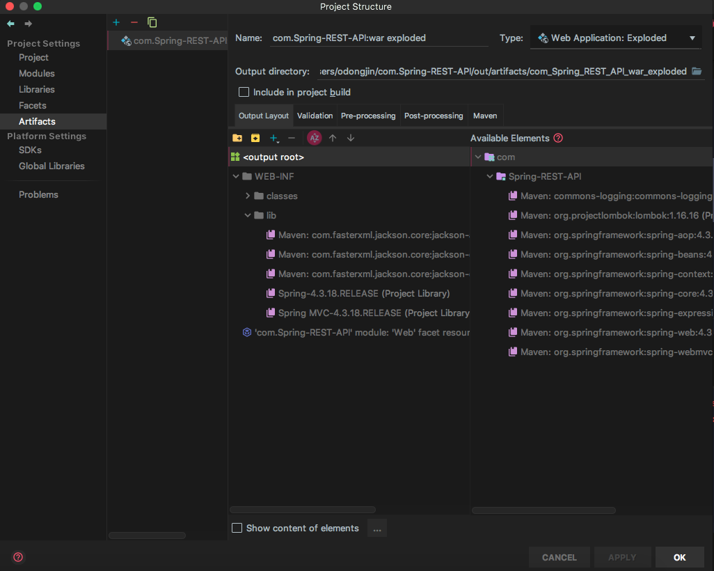

## Json 출력으로 Jackson 사용 No converter found for return value of type 에러 발생
  
  ```java
    <dependency>
        <groupId>com.fasterxml.jackson.core</groupId>
        <artifactId>jackson-databind</artifactId>
        <version>2.5.4</version>
    </dependency>
  ```

  * `pom.xml`에 의존성을 위와 같이 추가하였는데 `Json` 데이터는 나오지 않고
     `No converter found for return value of type` 에러만 나오는 답답한 상황이 발생
     https://mkil.tistory.com/426 (__나비와꽃기린__ 님 블로그)에서 하단에 해당 jar 파일들을
     다운받아 어플리케이션 lib 경로에 넣어주라는 말씀을 보고 `Project Structure`에 들어가 `Artifacts` 에서
     더블 클릭하여 lib 폴더에 넣어주었고 그 결과 정상적으로 Json 결과를 출력하였다
     

     
